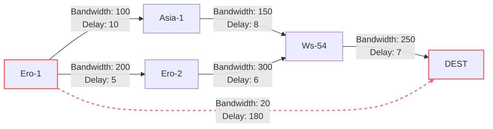

```mermaid
    graph LR
        %% Nodes (Satellites)
        1[Ero-1] -->|Bandwidth: 100<br>Delay: 10| 2[Asia-1]
        1[Ero-1] -->|Bandwidth: 200<br>Delay: 5| 3[Ero-2]
        2[Asia-1] -->|Bandwidth: 150<br>Delay: 8| 4[Ws-54]
        3[Ero-2] -->|Bandwidth: 300<br>Delay: 6| 4[Ws-54]
        4[Ws-54] -->|Bandwidth: 250<br>Delay: 7| 5[DEST]
        1[Ero-1] -.->|Bandwidth: 20<br>Delay: 180| 5[DEST]

        %% Styling for inactive link (EdgeId = 6)
        style 1 stroke:#f66,stroke-width:2px
        style 5 stroke:#f66,stroke-width:2px
        linkStyle 5 stroke:#f66,stroke-width:2px,stroke-dasharray:5
```